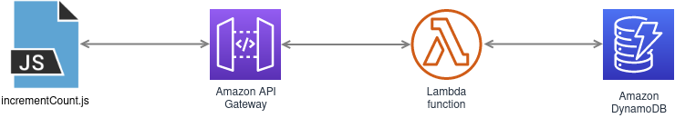

# visitorCounter

Counter of page views (still working on being unique visitor counter) for my home page at [livialima.net](https://livialima.net)

The idea is to update the **DynamoDB** table with the **Lambda function**. The function is called via **API Gateway** by the JavaScript function to present the counter value at a HTML page.

